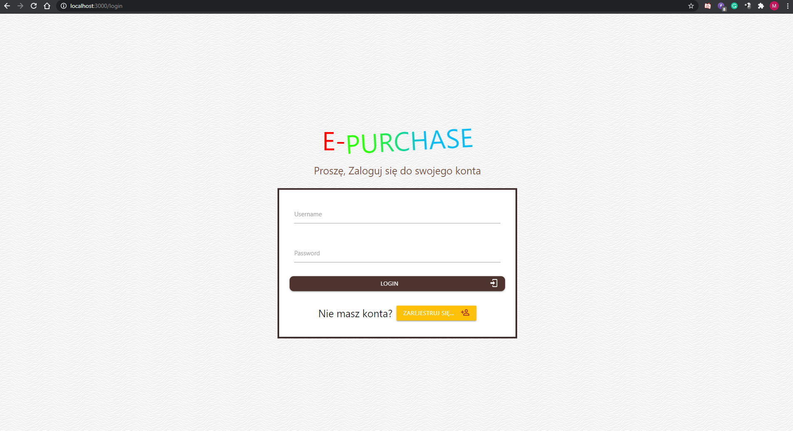
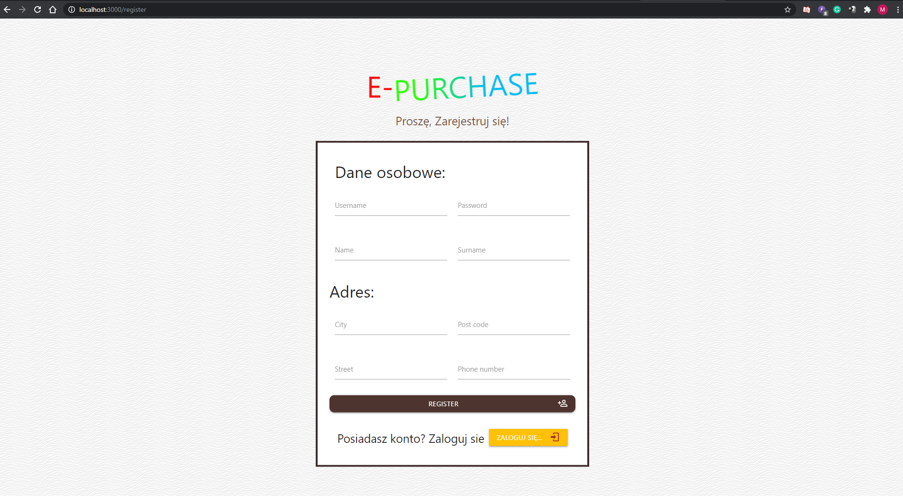
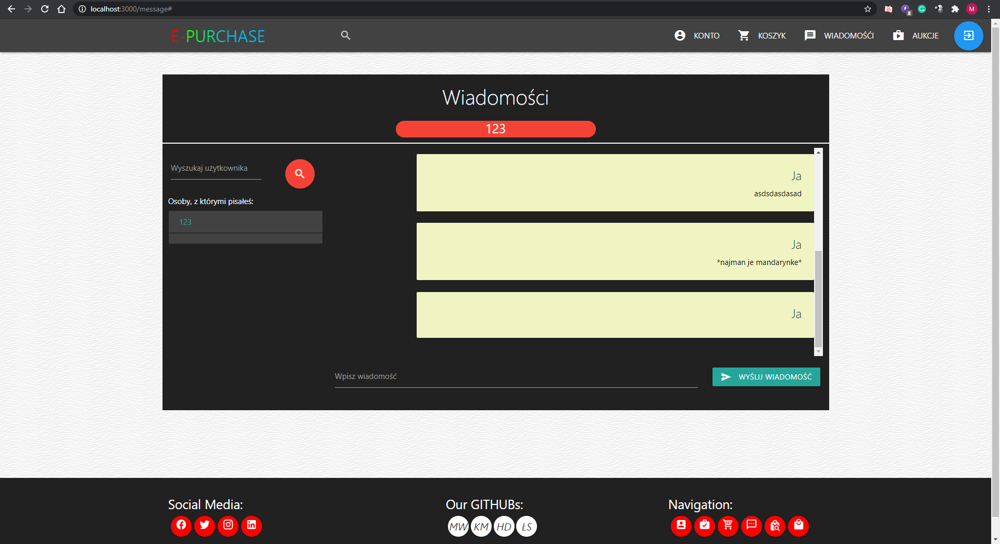
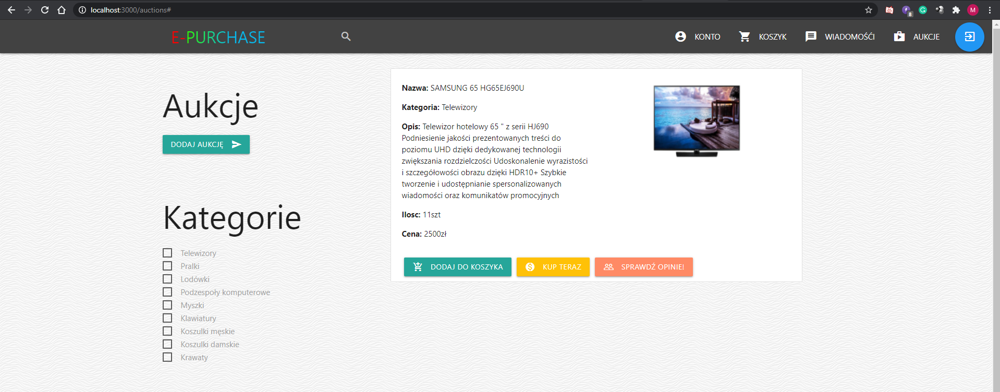
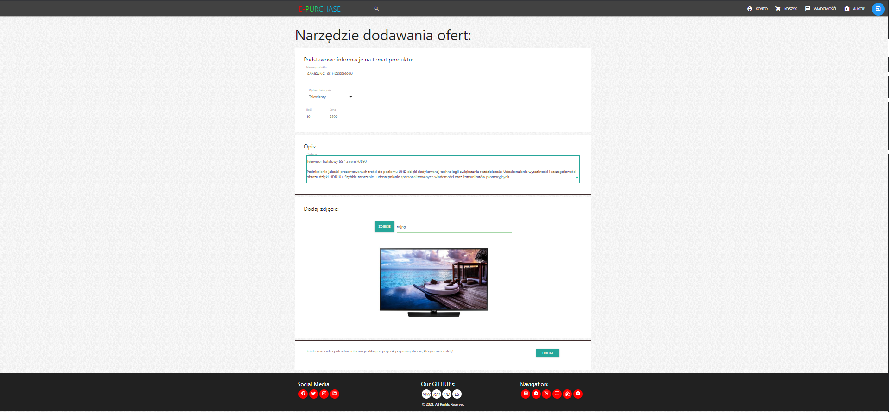
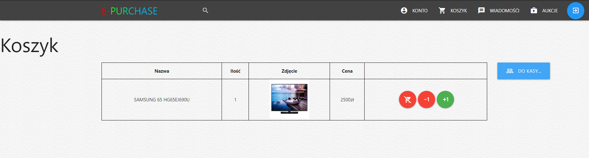
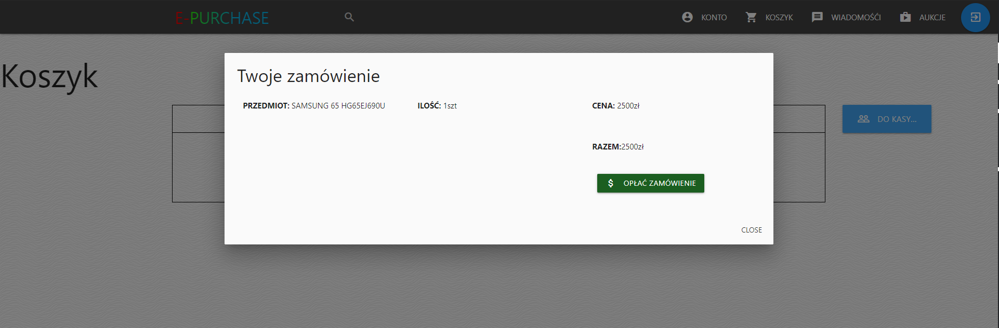
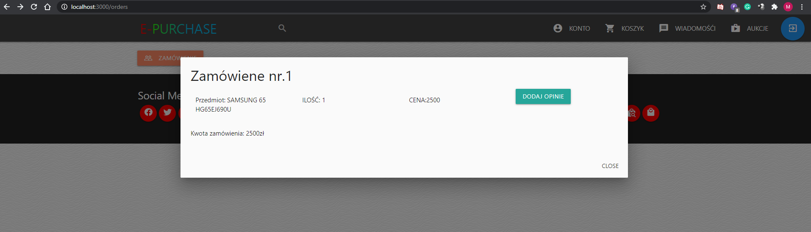
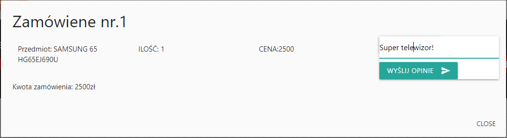
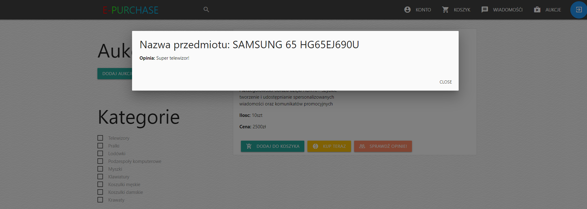

# E-PURCHASE
> E-PURCHASE is e-commerce web application that facilitates the sale of goods between third-party buyers and sellers. Buyers visit the site to search for products they want to buy from individual sellers. 
> Project made by Murczkiewicz Kacper;  Drzymalski Hubert;  Wesołek Mikołaj;  Szymański Łukasz;

## Table of contents
* [General info](#general-info)
* [Screenshots](#screenshots)
* [Technologies](#technologies)
* [Setup](#setup)
* [Status](#status)
* [Contact](#contact)

## General info
Buyers visit the site to search for products they want to buy from individual sellers. 
The site uses cookies to store user sessions. This project was done in agroup of four, in an agile methodology. 
We divided all tasks into weekly sprints. 
During the project we used tools such as github, heroku and jira. My tasks included:
-creating a module for adding reviews to a product (database CRUD),
-Frontend for register and sign in form
-Home tab
-responsiveness of the website
-creation of footer and navigation bar

## Screenshots
Login Form:

Register Form:

Home:

Messages:

Auctions:

Add Offer:

User Cart:

Buy Items:

Orders:

Add Opinion:

Opinions About items:


## Technologies
* React - version 17.0.1
* Jquery - version 3.5.1
* Materialize-css - version 1.0.0
* MySQL - version 8.0
* Express - version 4.17.1
* NodeJS - version 14.15.0
## Setup

before you start, you have to install on your computer the newest version of nodeJS, mySQL and React.

To run this project, install it locally using npm:

```
$ cd client
$ npm install
$ cd ..
$ cd server
$ cd npm install
$ node index.js
```
Open new Terminal then go client directory and use npm start

```
$ cd client
$ npm start
```

## Status
Project is:_no longer continue_ 


## Contact
Created by [ME](https://github.com/wesoly97) - feel free to contact me!
Created by [Kacper Murczkiewicz](https://github.com/kmurczkiewicz) - feel free to contact me!
Created by [Hubert Drzymalski](https://github.com/HubertDrzymalski) - feel free to contact me!
Created by [Łukasz Szymański](https://github.com/szyman-9) - feel free to contact me!
